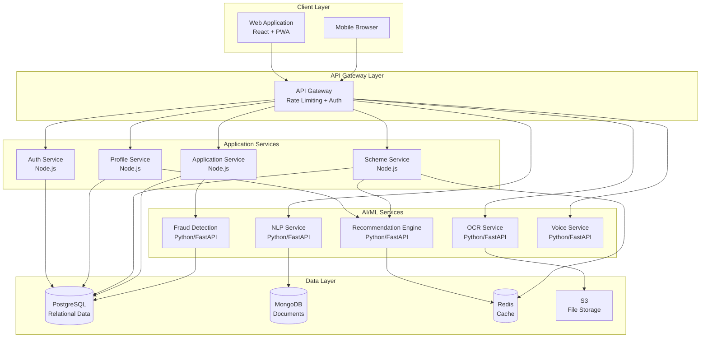
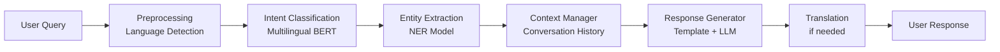
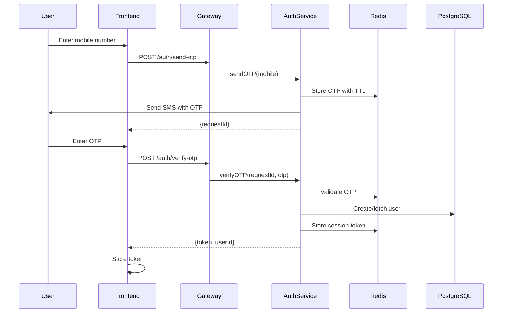
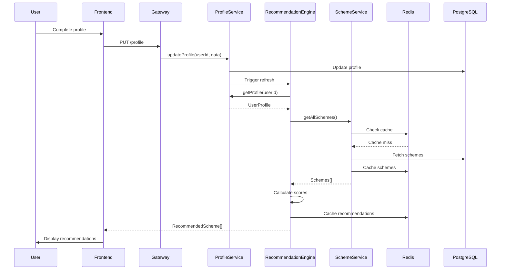
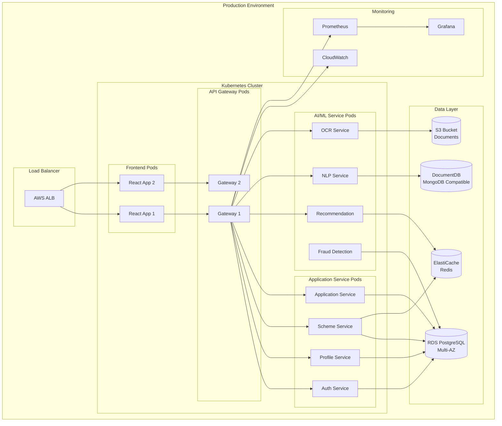

# YojanaSaathi AI - Design Document

## Overview

YojanaSaathi AI is a citizen-first intelligent platform that bridges the gap between Indian citizens and government welfare schemes. The system acts as an intelligent intermediary, leveraging AI/ML technologies to provide personalized scheme recommendations, multilingual support, and automated document processing.

### Design Philosophy

The design follows these core principles:

1. **Citizen-Centric**: Every component prioritizes ease of use for citizens with varying digital literacy levels
2. **Modular Architecture**: Loosely coupled services enable independent scaling and maintenance
3. **AI-First**: Machine learning models drive personalization, fraud detection, and natural language understanding
4. **Privacy-Preserving**: User data is encrypted and access-controlled at every layer
5. **Multilingual by Default**: All user-facing components support multiple Indian languages
6. **Offline-Tolerant**: Progressive web app capabilities enable limited offline functionality

### Technology Stack

**Frontend**:
- React.js with TypeScript for type safety and component reusability
- Tailwind CSS for responsive, mobile-first UI design
- React Query for efficient data fetching and caching
- i18next for internationalization and multilingual support
- Progressive Web App (PWA) capabilities for offline access

**Backend**:
- Node.js with Express.js for API server
- Python with FastAPI for AI/ML services
- PostgreSQL for relational data (user profiles, schemes, applications)
- MongoDB for unstructured data (chat logs, document metadata)
- Redis for caching and session management

**AI/ML Services**:
- Hugging Face Transformers for NLP (multilingual BERT models)
- Tesseract OCR with custom training for Indian documents
- scikit-learn for recommendation engine and fraud detection
- Google Cloud Speech-to-Text and Text-to-Speech APIs
- LangChain for chatbot orchestration

**Infrastructure**:
- Docker containers for service isolation
- Kubernetes for orchestration (production)
- AWS S3 for document storage
- AWS CloudFront for CDN
- GitHub Actions for CI/CD


## Architecture

### System Architecture Diagram



### Architecture Patterns

**Microservices Architecture**: The system is decomposed into independent services that communicate via REST APIs. This enables:
- Independent scaling of compute-intensive AI services
- Technology diversity (Node.js for I/O-bound, Python for ML)
- Fault isolation and resilience
- Team autonomy and parallel development

**API Gateway Pattern**: A single entry point handles:
- Request routing to appropriate services
- Authentication and authorization
- Rate limiting and throttling
- Request/response transformation
- API versioning

**CQRS (Command Query Responsibility Segregation)**: Separate read and write operations for:
- Scheme data (read-heavy): Optimized with caching
- Application submissions (write-heavy): Optimized for consistency
- User profiles: Balanced read/write optimization

**Event-Driven Architecture**: Asynchronous processing for:
- Document OCR processing (long-running)
- Fraud detection analysis (background)
- Notification delivery (decoupled)
- Application status updates (eventual consistency)


## Components and Interfaces

### 1. Authentication Service

**Responsibilities**:
- User registration with mobile OTP verification
- Session management and token generation
- Role-based access control

**Key Interfaces**:

```typescript
interface AuthService {
  // Send OTP to mobile number
  sendOTP(mobileNumber: string): Promise<{success: boolean, requestId: string}>
  
  // Verify OTP and create session
  verifyOTP(requestId: string, otp: string): Promise<{token: string, userId: string}>
  
  // Validate session token
  validateToken(token: string): Promise<{valid: boolean, userId: string}>
  
  // Logout and invalidate session
  logout(token: string): Promise<{success: boolean}>
}
```

**Technology Decisions**:
- JWT tokens for stateless authentication
- Redis for OTP storage (5-minute TTL)
- bcrypt for password hashing (if password auth added later)
- Rate limiting: 3 OTP requests per mobile per hour

### 2. Profile Service

**Responsibilities**:
- User profile CRUD operations
- Profile data validation
- Profile completeness scoring

**Key Interfaces**:

```typescript
interface UserProfile {
  userId: string
  personalInfo: {
    name: string
    dateOfBirth: Date
    gender: 'male' | 'female' | 'other'
    maritalStatus: 'single' | 'married' | 'widowed' | 'divorced'
    aadhaarNumber?: string  // encrypted
  }
  location: {
    state: string
    district: string
    block?: string
    village?: string
    pinCode: string
  }
  demographics: {
    category: 'general' | 'sc' | 'st' | 'obc' | 'ews'
    religion?: string
    minority?: boolean
  }
  economic: {
    occupation: string
    annualIncome: number
    bplCard?: boolean
    rationCardType?: 'apl' | 'bpl' | 'aay'
  }
  family: {
    familySize: number
    dependents: number
    children: Array<{age: number, gender: string, education: string}>
  }
  education: {
    qualification: string
    currentlyStudying?: boolean
  }
  assets: {
    landOwnership?: {
      owned: boolean
      area: number  // in acres
      irrigated: boolean
    }
    bankAccount: {
      accountNumber?: string  // encrypted
      ifscCode?: string
      bankName?: string
    }
  }
  disability?: {
    hasDisability: boolean
    disabilityType?: string
    disabilityPercentage?: number
    udidNumber?: string
  }
  preferences: {
    language: string
    notificationChannels: Array<'sms' | 'email' | 'push'>
  }
  metadata: {
    profileCompleteness: number  // 0-100
    createdAt: Date
    updatedAt: Date
  }
}

interface ProfileService {
  createProfile(userId: string, data: Partial<UserProfile>): Promise<UserProfile>
  getProfile(userId: string): Promise<UserProfile>
  updateProfile(userId: string, updates: Partial<UserProfile>): Promise<UserProfile>
  calculateCompleteness(profile: UserProfile): number
  validateProfile(profile: Partial<UserProfile>): {valid: boolean, errors: string[]}
}
```

### 3. Scheme Service

**Responsibilities**:
- Scheme data management and retrieval
- Scheme search and filtering
- Scheme eligibility rule evaluation

**Key Interfaces**:

```typescript
interface Scheme {
  schemeId: string
  name: {
    en: string
    hi: string
    [languageCode: string]: string
  }
  description: {
    en: string
    hi: string
    [languageCode: string]: string
  }
  category: 'agriculture' | 'education' | 'health' | 'employment' | 'housing' | 'social_welfare'
  level: 'central' | 'state'
  state?: string  // if state-level scheme
  department: string
  benefits: {
    type: 'financial' | 'subsidy' | 'service' | 'training'
    amount?: number
    description: {[languageCode: string]: string}
  }
  eligibility: {
    rules: Array<EligibilityRule>
    requiredDocuments: Array<DocumentRequirement>
  }
  applicationProcess: {
    steps: Array<{
      stepNumber: number
      description: {[languageCode: string]: string}
    }>
    estimatedTime: string
    applicationUrl?: string
  }
  timeline: {
    startDate?: Date
    endDate?: Date
    isOngoing: boolean
  }
  metadata: {
    popularity: number
    successRate: number
    averageProcessingDays: number
    lastUpdated: Date
  }
}

interface EligibilityRule {
  field: string  // e.g., 'annualIncome', 'age', 'category'
  operator: 'eq' | 'lt' | 'lte' | 'gt' | 'gte' | 'in' | 'contains'
  value: any
  weight: number  // for scoring
}

interface DocumentRequirement {
  documentType: string
  mandatory: boolean
  description: {[languageCode: string]: string}
  sampleUrl?: string
}

interface SchemeService {
  getScheme(schemeId: string, language: string): Promise<Scheme>
  searchSchemes(query: string, filters: SchemeFilters, language: string): Promise<Scheme[]>
  getAllSchemes(filters: SchemeFilters, language: string): Promise<Scheme[]>
  evaluateEligibility(schemeId: string, profile: UserProfile): Promise<EligibilityResult>
  getTrendingSchemes(limit: number, language: string): Promise<Scheme[]>
  compareSchemes(schemeIds: string[], language: string): Promise<SchemeComparison>
}

interface SchemeFilters {
  category?: string[]
  state?: string
  level?: 'central' | 'state'
  benefitType?: string[]
  hasDeadline?: boolean
}

interface EligibilityResult {
  eligible: boolean
  matchScore: number  // 0-100
  matchedCriteria: string[]
  unmatchedCriteria: string[]
  missingProfileData: string[]
  explanation: {[languageCode: string]: string}
}
```


### 4. Recommendation Engine

**Responsibilities**:
- Generate personalized scheme recommendations
- Rank schemes by relevance and benefit
- Explain recommendation reasoning

**Algorithm Design**:

The recommendation engine uses a hybrid approach combining:

1. **Rule-Based Matching**: Evaluate explicit eligibility criteria
2. **Collaborative Filtering**: Learn from similar user profiles
3. **Content-Based Filtering**: Match profile attributes to scheme characteristics
4. **Ranking Model**: Score and prioritize recommendations

**Key Interfaces**:

```typescript
interface RecommendationEngine {
  getRecommendations(
    userId: string, 
    options: RecommendationOptions
  ): Promise<RecommendedScheme[]>
  
  explainRecommendation(
    userId: string, 
    schemeId: string, 
    language: string
  ): Promise<RecommendationExplanation>
  
  refreshRecommendations(userId: string): Promise<void>
}

interface RecommendationOptions {
  limit?: number
  category?: string[]
  minMatchScore?: number
  language: string
}

interface RecommendedScheme {
  scheme: Scheme
  matchScore: number
  eligibilityStatus: 'eligible' | 'partially_eligible' | 'not_eligible'
  priority: 'high' | 'medium' | 'low'
  reasoning: {
    matchedAttributes: string[]
    benefitValue: number
    deadlineProximity?: number
    popularityScore: number
  }
}

interface RecommendationExplanation {
  schemeId: string
  schemeName: string
  matchScore: number
  explanation: string
  matchedCriteria: Array<{
    criterion: string
    userValue: any
    requiredValue: any
    matched: boolean
  }>
  suggestedActions: string[]
}
```

**Scoring Formula**:

```
FinalScore = (
  0.5 * EligibilityScore +
  0.2 * BenefitScore +
  0.15 * DeadlineScore +
  0.10 * PopularityScore +
  0.05 * ProfileCompletenessBonus
)

Where:
- EligibilityScore: Percentage of criteria matched (0-100)
- BenefitScore: Normalized benefit amount (0-100)
- DeadlineScore: Urgency based on deadline proximity (0-100)
- PopularityScore: Based on application success rate (0-100)
- ProfileCompletenessBonus: Incentive for complete profiles (0-10)
```

### 5. NLP Service (Chatbot)

**Responsibilities**:
- Natural language understanding and intent classification
- Entity extraction from user queries
- Context-aware response generation
- Multilingual conversation handling

**Architecture**:



**Key Interfaces**:

```typescript
interface NLPService {
  processQuery(
    userId: string,
    query: string,
    language: string,
    conversationId?: string
  ): Promise<ChatResponse>
  
  detectIntent(query: string, language: string): Promise<Intent>
  
  extractEntities(query: string, language: string): Promise<Entity[]>
  
  getConversationHistory(conversationId: string): Promise<Message[]>
}

interface Intent {
  name: string  // e.g., 'scheme_search', 'eligibility_check', 'application_status'
  confidence: number
  parameters: Record<string, any>
}

interface Entity {
  type: string  // e.g., 'scheme_name', 'category', 'location'
  value: string
  confidence: number
}

interface ChatResponse {
  conversationId: string
  response: string
  intent: Intent
  entities: Entity[]
  suggestedActions?: Array<{
    label: string
    action: string
    data?: any
  }>
  relatedSchemes?: string[]
}

interface Message {
  messageId: string
  conversationId: string
  sender: 'user' | 'bot'
  text: string
  intent?: Intent
  timestamp: Date
}
```

**Supported Intents**:
- `scheme_search`: Find schemes by category, benefit, or keyword
- `eligibility_check`: Check eligibility for specific scheme
- `application_status`: Query application status
- `document_help`: Get help with required documents
- `general_info`: General information about schemes
- `greeting`: Conversation initiation
- `fallback`: Unknown intent handling

### 6. OCR Service

**Responsibilities**:
- Extract text and structured data from document images
- Validate extracted data against expected formats
- Handle multiple document types with specialized parsers

**Key Interfaces**:

```typescript
interface OCRService {
  extractDocument(
    documentImage: Buffer,
    documentType: DocumentType
  ): Promise<ExtractedData>
  
  validateExtraction(
    extractedData: ExtractedData,
    documentType: DocumentType
  ): Promise<ValidationResult>
}

type DocumentType = 'aadhaar' | 'bank_passbook' | 'land_record' | 'income_certificate'

interface ExtractedData {
  documentType: DocumentType
  confidence: number
  fields: Record<string, {
    value: string
    confidence: number
    boundingBox?: {x: number, y: number, width: number, height: number}
  }>
  rawText: string
}

interface ValidationResult {
  valid: boolean
  errors: Array<{
    field: string
    error: string
    suggestion?: string
  }>
  warnings: string[]
}
```

**Document-Specific Parsers**:

1. **Aadhaar Parser**:
   - Regex patterns for 12-digit Aadhaar number
   - Date format validation for DOB
   - Address extraction using NER
   - Gender detection from keywords

2. **Bank Passbook Parser**:
   - Account number extraction (9-18 digits)
   - IFSC code validation (11 characters)
   - Bank name matching against known banks
   - Branch extraction

3. **Land Record Parser**:
   - Survey/plot number extraction
   - Area measurement parsing (acres/hectares)
   - Owner name extraction
   - Location details parsing

4. **Income Certificate Parser**:
   - Certificate number extraction
   - Income amount parsing
   - Issuing authority detection
   - Validity date extraction

**OCR Pipeline**:

```
Image Input
  ↓
Image Preprocessing (deskew, denoise, enhance)
  ↓
Tesseract OCR (with custom training data)
  ↓
Post-processing (spell check, format correction)
  ↓
Document-specific parsing
  ↓
Field validation
  ↓
Structured output
```


### 7. Fraud Detection Service

**Responsibilities**:
- Detect duplicate applications
- Identify suspicious patterns and anomalies
- Flag potentially fraudulent submissions
- Maintain audit logs

**Detection Strategies**:

1. **Duplicate Detection**:
   - Hash-based matching of user+scheme combinations
   - Document similarity using perceptual hashing
   - Profile data fuzzy matching

2. **Anomaly Detection**:
   - Unusual application frequency patterns
   - Inconsistent profile data
   - Suspicious document uploads
   - Device/IP fingerprinting

3. **Rule-Based Checks**:
   - Multiple applications from same device
   - Identical documents across users
   - Profile data inconsistencies
   - Rapid successive submissions

**Key Interfaces**:

```typescript
interface FraudDetectionService {
  analyzeApplication(
    userId: string,
    schemeId: string,
    documents: Document[]
  ): Promise<FraudAnalysis>
  
  checkDuplicate(
    userId: string,
    schemeId: string
  ): Promise<DuplicateCheckResult>
  
  flagSuspicious(
    applicationId: string,
    reason: string,
    severity: 'low' | 'medium' | 'high'
  ): Promise<void>
  
  getAuditLog(applicationId: string): Promise<AuditEntry[]>
}

interface FraudAnalysis {
  riskScore: number  // 0-100, higher = more suspicious
  flags: Array<{
    type: string
    severity: 'low' | 'medium' | 'high'
    description: string
    evidence: any
  }>
  recommendation: 'approve' | 'review' | 'reject'
  duplicateApplications: string[]
  similarDocuments: Array<{
    documentId: string
    similarity: number
    userId: string
  }>
}

interface DuplicateCheckResult {
  isDuplicate: boolean
  existingApplications: Array<{
    applicationId: string
    submittedAt: Date
    status: string
  }>
}

interface AuditEntry {
  timestamp: Date
  action: string
  actor: string
  details: Record<string, any>
  ipAddress: string
  deviceFingerprint: string
}
```

**Risk Scoring Model**:

```
RiskScore = (
  DuplicateWeight * DuplicateScore +
  FrequencyWeight * FrequencyScore +
  ConsistencyWeight * ConsistencyScore +
  DocumentWeight * DocumentScore
)

Where:
- DuplicateScore: Presence of duplicate applications (0 or 100)
- FrequencyScore: Application frequency anomaly (0-100)
- ConsistencyScore: Profile data inconsistency (0-100)
- DocumentScore: Document similarity to other users (0-100)

Weights: [0.4, 0.2, 0.2, 0.2]
```

### 8. Application Service

**Responsibilities**:
- Application submission and management
- Document checklist generation
- Application status tracking
- Notification management

**Key Interfaces**:

```typescript
interface Application {
  applicationId: string
  userId: string
  schemeId: string
  status: 'draft' | 'submitted' | 'under_review' | 'approved' | 'rejected'
  submittedAt?: Date
  documents: Array<{
    documentType: string
    documentId: string
    uploadedAt: Date
    verified: boolean
  }>
  checklist: DocumentChecklist
  fraudAnalysis?: FraudAnalysis
  timeline: Array<{
    status: string
    timestamp: Date
    notes?: string
  }>
  metadata: {
    createdAt: Date
    updatedAt: Date
    completionPercentage: number
  }
}

interface DocumentChecklist {
  schemeId: string
  items: Array<{
    documentType: string
    mandatory: boolean
    description: string
    uploaded: boolean
    documentId?: string
    status: 'pending' | 'uploaded' | 'verified' | 'rejected'
  }>
  completionPercentage: number
}

interface ApplicationService {
  createApplication(userId: string, schemeId: string): Promise<Application>
  
  getApplication(applicationId: string): Promise<Application>
  
  updateApplication(
    applicationId: string,
    updates: Partial<Application>
  ): Promise<Application>
  
  submitApplication(applicationId: string): Promise<Application>
  
  uploadDocument(
    applicationId: string,
    documentType: string,
    file: Buffer
  ): Promise<{documentId: string, extractedData: ExtractedData}>
  
  generateChecklist(
    userId: string,
    schemeId: string
  ): Promise<DocumentChecklist>
  
  getApplicationHistory(userId: string): Promise<Application[]>
  
  trackApplication(applicationId: string): Promise<ApplicationTracking>
}

interface ApplicationTracking {
  applicationId: string
  currentStatus: string
  timeline: Array<{
    status: string
    timestamp: Date
    description: string
  }>
  estimatedCompletionDate?: Date
  nextSteps: string[]
}
```

### 9. Voice Service

**Responsibilities**:
- Speech-to-text conversion for voice input
- Text-to-speech conversion for voice output
- Language detection and translation
- Audio preprocessing and enhancement

**Key Interfaces**:

```typescript
interface VoiceService {
  speechToText(
    audioBuffer: Buffer,
    language: string
  ): Promise<SpeechToTextResult>
  
  textToSpeech(
    text: string,
    language: string,
    voice?: VoiceOptions
  ): Promise<Buffer>
  
  detectLanguage(audioBuffer: Buffer): Promise<string>
}

interface SpeechToTextResult {
  text: string
  confidence: number
  language: string
  alternatives?: Array<{
    text: string
    confidence: number
  }>
}

interface VoiceOptions {
  gender: 'male' | 'female'
  speed: number  // 0.5 to 2.0
  pitch: number  // -20 to 20
}
```

**Supported Languages**:
- Hindi (hi-IN)
- English (en-IN)
- Tamil (ta-IN)
- Telugu (te-IN)
- Bengali (bn-IN)


## Data Models

### Database Schema Design

**PostgreSQL Schema** (Relational Data):

```sql
-- Users table
CREATE TABLE users (
  user_id UUID PRIMARY KEY DEFAULT gen_random_uuid(),
  mobile_number VARCHAR(15) UNIQUE NOT NULL,
  mobile_verified BOOLEAN DEFAULT FALSE,
  created_at TIMESTAMP DEFAULT CURRENT_TIMESTAMP,
  updated_at TIMESTAMP DEFAULT CURRENT_TIMESTAMP,
  last_login TIMESTAMP
);

-- User profiles table
CREATE TABLE user_profiles (
  profile_id UUID PRIMARY KEY DEFAULT gen_random_uuid(),
  user_id UUID REFERENCES users(user_id) ON DELETE CASCADE,
  
  -- Personal information (encrypted fields marked with _enc)
  full_name VARCHAR(255) NOT NULL,
  date_of_birth DATE,
  gender VARCHAR(20),
  marital_status VARCHAR(20),
  aadhaar_number_enc TEXT,  -- encrypted
  
  -- Location
  state VARCHAR(100),
  district VARCHAR(100),
  block VARCHAR(100),
  village VARCHAR(100),
  pin_code VARCHAR(10),
  
  -- Demographics
  category VARCHAR(20),
  religion VARCHAR(50),
  is_minority BOOLEAN,
  
  -- Economic
  occupation VARCHAR(100),
  annual_income DECIMAL(12, 2),
  has_bpl_card BOOLEAN,
  ration_card_type VARCHAR(10),
  
  -- Family
  family_size INTEGER,
  dependents INTEGER,
  
  -- Education
  education_qualification VARCHAR(100),
  currently_studying BOOLEAN,
  
  -- Disability
  has_disability BOOLEAN,
  disability_type VARCHAR(100),
  disability_percentage INTEGER,
  udid_number VARCHAR(50),
  
  -- Preferences
  preferred_language VARCHAR(10) DEFAULT 'en',
  notification_sms BOOLEAN DEFAULT TRUE,
  notification_email BOOLEAN DEFAULT FALSE,
  
  -- Metadata
  profile_completeness INTEGER DEFAULT 0,
  created_at TIMESTAMP DEFAULT CURRENT_TIMESTAMP,
  updated_at TIMESTAMP DEFAULT CURRENT_TIMESTAMP,
  
  CONSTRAINT valid_completeness CHECK (profile_completeness BETWEEN 0 AND 100)
);

-- Family members table
CREATE TABLE family_members (
  member_id UUID PRIMARY KEY DEFAULT gen_random_uuid(),
  profile_id UUID REFERENCES user_profiles(profile_id) ON DELETE CASCADE,
  relationship VARCHAR(50),
  age INTEGER,
  gender VARCHAR(20),
  education VARCHAR(100),
  occupation VARCHAR(100)
);

-- Land ownership table
CREATE TABLE land_ownership (
  land_id UUID PRIMARY KEY DEFAULT gen_random_uuid(),
  profile_id UUID REFERENCES user_profiles(profile_id) ON DELETE CASCADE,
  land_area DECIMAL(10, 2),  -- in acres
  is_irrigated BOOLEAN,
  survey_number VARCHAR(100),
  location VARCHAR(255)
);

-- Bank accounts table
CREATE TABLE bank_accounts (
  account_id UUID PRIMARY KEY DEFAULT gen_random_uuid(),
  profile_id UUID REFERENCES user_profiles(profile_id) ON DELETE CASCADE,
  account_number_enc TEXT,  -- encrypted
  ifsc_code VARCHAR(11),
  bank_name VARCHAR(255),
  branch_name VARCHAR(255),
  is_primary BOOLEAN DEFAULT FALSE
);

-- Schemes table
CREATE TABLE schemes (
  scheme_id UUID PRIMARY KEY DEFAULT gen_random_uuid(),
  scheme_code VARCHAR(50) UNIQUE NOT NULL,
  
  -- Basic info
  name_en TEXT NOT NULL,
  name_hi TEXT,
  name_ta TEXT,
  name_te TEXT,
  name_bn TEXT,
  
  description_en TEXT,
  description_hi TEXT,
  description_ta TEXT,
  description_te TEXT,
  description_bn TEXT,
  
  -- Classification
  category VARCHAR(50) NOT NULL,
  level VARCHAR(20) NOT NULL,  -- 'central' or 'state'
  state VARCHAR(100),
  department VARCHAR(255),
  
  -- Benefits
  benefit_type VARCHAR(50),
  benefit_amount DECIMAL(12, 2),
  
  -- Timeline
  start_date DATE,
  end_date DATE,
  is_ongoing BOOLEAN DEFAULT TRUE,
  
  -- Metadata
  popularity_score INTEGER DEFAULT 0,
  success_rate DECIMAL(5, 2),
  avg_processing_days INTEGER,
  
  created_at TIMESTAMP DEFAULT CURRENT_TIMESTAMP,
  updated_at TIMESTAMP DEFAULT CURRENT_TIMESTAMP,
  
  CONSTRAINT valid_level CHECK (level IN ('central', 'state'))
);

-- Eligibility rules table
CREATE TABLE eligibility_rules (
  rule_id UUID PRIMARY KEY DEFAULT gen_random_uuid(),
  scheme_id UUID REFERENCES schemes(scheme_id) ON DELETE CASCADE,
  field_name VARCHAR(100) NOT NULL,
  operator VARCHAR(20) NOT NULL,
  value_json JSONB NOT NULL,
  weight DECIMAL(3, 2) DEFAULT 1.0,
  
  CONSTRAINT valid_operator CHECK (operator IN ('eq', 'lt', 'lte', 'gt', 'gte', 'in', 'contains'))
);

-- Document requirements table
CREATE TABLE document_requirements (
  requirement_id UUID PRIMARY KEY DEFAULT gen_random_uuid(),
  scheme_id UUID REFERENCES schemes(scheme_id) ON DELETE CASCADE,
  document_type VARCHAR(100) NOT NULL,
  is_mandatory BOOLEAN DEFAULT TRUE,
  description_en TEXT,
  description_hi TEXT,
  description_ta TEXT,
  description_te TEXT,
  description_bn TEXT,
  sample_url TEXT
);

-- Applications table
CREATE TABLE applications (
  application_id UUID PRIMARY KEY DEFAULT gen_random_uuid(),
  user_id UUID REFERENCES users(user_id) ON DELETE CASCADE,
  scheme_id UUID REFERENCES schemes(scheme_id) ON DELETE CASCADE,
  
  status VARCHAR(50) DEFAULT 'draft',
  submitted_at TIMESTAMP,
  
  -- Fraud detection
  risk_score INTEGER DEFAULT 0,
  fraud_flags JSONB,
  
  -- Metadata
  completion_percentage INTEGER DEFAULT 0,
  created_at TIMESTAMP DEFAULT CURRENT_TIMESTAMP,
  updated_at TIMESTAMP DEFAULT CURRENT_TIMESTAMP,
  
  CONSTRAINT valid_status CHECK (status IN ('draft', 'submitted', 'under_review', 'approved', 'rejected')),
  CONSTRAINT unique_user_scheme UNIQUE (user_id, scheme_id)
);

-- Application timeline table
CREATE TABLE application_timeline (
  timeline_id UUID PRIMARY KEY DEFAULT gen_random_uuid(),
  application_id UUID REFERENCES applications(application_id) ON DELETE CASCADE,
  status VARCHAR(50) NOT NULL,
  notes TEXT,
  timestamp TIMESTAMP DEFAULT CURRENT_TIMESTAMP
);

-- Documents table
CREATE TABLE documents (
  document_id UUID PRIMARY KEY DEFAULT gen_random_uuid(),
  application_id UUID REFERENCES applications(application_id) ON DELETE CASCADE,
  document_type VARCHAR(100) NOT NULL,
  
  -- Storage
  file_path TEXT NOT NULL,  -- S3 path
  file_size INTEGER,
  mime_type VARCHAR(100),
  
  -- OCR data
  extracted_data JSONB,
  ocr_confidence DECIMAL(5, 2),
  
  -- Verification
  is_verified BOOLEAN DEFAULT FALSE,
  verified_at TIMESTAMP,
  verified_by UUID,
  
  uploaded_at TIMESTAMP DEFAULT CURRENT_TIMESTAMP
);

-- Audit log table
CREATE TABLE audit_log (
  log_id UUID PRIMARY KEY DEFAULT gen_random_uuid(),
  user_id UUID REFERENCES users(user_id),
  application_id UUID REFERENCES applications(application_id),
  action VARCHAR(100) NOT NULL,
  details JSONB,
  ip_address INET,
  device_fingerprint TEXT,
  timestamp TIMESTAMP DEFAULT CURRENT_TIMESTAMP
);

-- Recommendations cache table
CREATE TABLE recommendation_cache (
  cache_id UUID PRIMARY KEY DEFAULT gen_random_uuid(),
  user_id UUID REFERENCES users(user_id) ON DELETE CASCADE,
  recommendations JSONB NOT NULL,
  generated_at TIMESTAMP DEFAULT CURRENT_TIMESTAMP,
  expires_at TIMESTAMP,
  
  CONSTRAINT unique_user_cache UNIQUE (user_id)
);

-- Indexes for performance
CREATE INDEX idx_users_mobile ON users(mobile_number);
CREATE INDEX idx_profiles_user ON user_profiles(user_id);
CREATE INDEX idx_schemes_category ON schemes(category);
CREATE INDEX idx_schemes_state ON schemes(state);
CREATE INDEX idx_applications_user ON applications(user_id);
CREATE INDEX idx_applications_scheme ON applications(scheme_id);
CREATE INDEX idx_applications_status ON applications(status);
CREATE INDEX idx_documents_application ON documents(application_id);
CREATE INDEX idx_audit_user ON audit_log(user_id);
CREATE INDEX idx_audit_timestamp ON audit_log(timestamp);
```

**MongoDB Collections** (Unstructured Data):

```javascript
// Conversations collection
{
  _id: ObjectId,
  conversationId: String,
  userId: String,
  language: String,
  messages: [
    {
      messageId: String,
      sender: String,  // 'user' or 'bot'
      text: String,
      intent: {
        name: String,
        confidence: Number,
        parameters: Object
      },
      entities: [
        {
          type: String,
          value: String,
          confidence: Number
        }
      ],
      timestamp: Date
    }
  ],
  metadata: {
    deviceType: String,
    platform: String,
    sessionDuration: Number
  },
  createdAt: Date,
  updatedAt: Date
}

// Document metadata collection
{
  _id: ObjectId,
  documentId: String,
  applicationId: String,
  userId: String,
  documentType: String,
  
  // OCR processing
  ocrRawText: String,
  ocrProcessingTime: Number,
  ocrVersion: String,
  
  // Image metadata
  imageMetadata: {
    width: Number,
    height: Number,
    format: String,
    colorSpace: String,
    dpi: Number
  },
  
  // Fraud detection
  perceptualHash: String,
  similarDocuments: [
    {
      documentId: String,
      similarity: Number
    }
  ],
  
  createdAt: Date
}

// Analytics events collection
{
  _id: ObjectId,
  eventType: String,
  userId: String,
  schemeId: String,
  eventData: Object,
  timestamp: Date,
  sessionId: String
}
```

**Redis Data Structures** (Caching):

```
# Session tokens
session:{token} -> {userId, expiresAt}  [TTL: 24 hours]

# OTP storage
otp:{requestId} -> {mobileNumber, otp, attempts}  [TTL: 5 minutes]

# Scheme cache
scheme:{schemeId}:{language} -> {scheme JSON}  [TTL: 1 hour]

# Recommendation cache
recommendations:{userId} -> {recommendations JSON}  [TTL: 6 hours]

# Rate limiting
ratelimit:otp:{mobileNumber} -> count  [TTL: 1 hour]
ratelimit:api:{userId} -> count  [TTL: 1 minute]

# Active users
active_users -> Set of userIds  [TTL: 30 minutes]
```

### Data Flow Diagrams

**User Registration Flow**:



**Scheme Recommendation Flow**:




## Correctness Properties

*A property is a characteristic or behavior that should hold true across all valid executions of a system—essentially, a formal statement about what the system should do. Properties serve as the bridge between human-readable specifications and machine-verifiable correctness guarantees.*

### Property 1: OTP Registration Round-Trip

*For any* valid mobile number, sending an OTP and verifying it with the correct OTP code should create a valid user session with a token that can be used for authenticated requests.

**Validates: FR-01**

### Property 2: Profile Data Round-Trip

*For any* user profile and any valid profile updates, storing the updates and then retrieving the profile should return data that includes all the updated fields with their new values.

**Validates: FR-02, FR-03**

### Property 3: Multilingual Support Consistency

*For any* supported language (Hindi, English, Tamil, Telugu, Bengali), creating a profile or making a chatbot query in that language should return responses in the same language with all user-facing text properly translated.

**Validates: FR-04, FR-11**

### Property 4: Recommendation Eligibility Scoring

*For any* user profile, all recommended schemes should have a match score between 0 and 100, and schemes with higher eligibility match scores should be ranked before schemes with lower scores (when other factors are equal).

**Validates: FR-05, FR-06**

### Property 5: Scheme Data Completeness

*For any* scheme retrieved from the system, the response should contain all required fields: name, description, eligibility criteria, benefits, required documents, and application process information.

**Validates: FR-07**

### Property 6: Filter Correctness

*For any* combination of filters (category, benefit type, eligibility criteria, deadline, state/central), all returned schemes should match every applied filter condition.

**Validates: FR-08, FR-40**

### Property 7: Recommendation Explanation Traceability

*For any* recommended scheme, the explanation should reference at least one profile attribute that matched an eligibility criterion, and all referenced attributes should actually exist in the user's profile.

**Validates: FR-09**

### Property 8: Intent and Entity Extraction

*For any* user query to the chatbot, the response should include a detected intent with a confidence score between 0 and 1, and any extracted entities should have confidence scores between 0 and 1.

**Validates: FR-10, FR-15**

### Property 9: Speech-to-Text Conversion

*For any* audio input in a supported language, the speech-to-text service should return extracted text with a confidence score between 0 and 1, and the detected language should match one of the supported languages.

**Validates: FR-12**

### Property 10: Text-to-Speech Conversion

*For any* text string and supported language, the text-to-speech service should generate audio output in the specified language without errors.

**Validates: FR-13**

### Property 11: Conversation History Ordering

*For any* conversation, retrieving the conversation history should return all messages in chronological order (sorted by timestamp ascending), with user and bot messages alternating correctly.

**Validates: FR-14**

### Property 12: OCR Extraction Completeness

*For any* document image of a supported type (Aadhaar, bank passbook, land record, income certificate), the OCR extraction should return data for all required fields for that document type, even if some fields have low confidence scores.

**Validates: FR-16, FR-17, FR-18, FR-19**

### Property 13: OCR to Profile Integration

*For any* OCR extraction result, auto-populating the profile should update all corresponding profile fields with the extracted values, and retrieving the profile should show these updated values.

**Validates: FR-20**

### Property 14: OCR Data Editability

*For any* extracted OCR data, users should be able to modify any field value, and the modified values should be used instead of the original extracted values in subsequent operations.

**Validates: FR-21**

### Property 15: Image Format Support

*For any* image file in a supported format (JPG, PNG, PDF), uploading the file should succeed and trigger OCR processing that returns extracted data or an error message.

**Validates: FR-22**

### Property 16: Document Checklist Completeness

*For any* user profile and scheme combination, the generated document checklist should include all mandatory documents required by that scheme, and documents that don't apply to the user's profile should be excluded.

**Validates: FR-23**

### Property 17: Checklist State Tracking

*For any* document checklist, uploading a document for a checklist item should mark that item as uploaded, and the checklist should accurately reflect which items have been uploaded and which are still pending.

**Validates: FR-24, FR-26**

### Property 18: Document Template Availability

*For any* document type that has a template or sample format, the document requirement should include a valid template URL that can be accessed.

**Validates: FR-25**

### Property 19: Application Submission Validation

*For any* application, attempting to submit should only succeed if all mandatory documents in the checklist are uploaded; otherwise, submission should fail with a clear error message listing missing documents.

**Validates: FR-27**

### Property 20: Duplicate Application Prevention

*For any* user and scheme combination, after successfully submitting an application, attempting to submit another application for the same scheme should be detected and prevented with an appropriate error message.

**Validates: FR-28, FR-32**

### Property 21: Fraud Risk Scoring

*For any* application submission, the fraud detection service should calculate a risk score between 0 and 100, and applications with suspicious patterns (multiple from same IP, identical documents, profile inconsistencies) should have higher risk scores than normal applications.

**Validates: FR-29, FR-30**

### Property 22: Audit Log Completeness

*For any* application action (create, update, submit, status change), an audit log entry should be created with a timestamp, action type, user ID, and relevant details, and retrieving the audit log should return all entries in chronological order.

**Validates: FR-31**

### Property 23: Application Guidance Completeness

*For any* scheme, the application guidance should include at least one step, and all steps should be numbered sequentially starting from 1.

**Validates: FR-33**

### Property 24: Draft Application Persistence

*For any* application in draft status, saving the application state and then retrieving it should return the same data including all filled fields and uploaded documents.

**Validates: FR-34**

### Property 25: Application Summary Completeness

*For any* application ready for submission, the generated summary should include the scheme name, all user-provided data, and a list of all uploaded documents.

**Validates: FR-35**

### Property 26: Application Tracking Data Completeness

*For any* submitted application, the tracking information should include application ID, submission date, current status, and timeline entries, with all timeline entries sorted chronologically.

**Validates: FR-36**

### Property 27: Status Change Notification Queuing

*For any* application status change, if the user has enabled SMS or email notifications, a notification should be queued for each enabled channel.

**Validates: FR-37**

### Property 28: Application History Ordering

*For any* user with multiple applications, retrieving the application history should return all applications sorted by submission date in descending order (most recent first).

**Validates: FR-38**

### Property 29: Keyword Search Relevance

*For any* keyword search query, all returned schemes should contain the keyword (case-insensitive) in either the scheme name or description in the requested language.

**Validates: FR-39**

### Property 30: Trending Schemes Ordering

*For any* request for trending schemes, the returned schemes should be ordered by popularity score in descending order (highest popularity first).

**Validates: FR-41**

### Property 31: Scheme Comparison Completeness

*For any* set of schemes being compared, the comparison result should include all key attributes (name, category, benefits, eligibility, documents, deadline) for each scheme in a structured format.

**Validates: FR-42**


## Error Handling

### Error Classification

**Client Errors (4xx)**:
- `400 Bad Request`: Invalid input data, malformed requests
- `401 Unauthorized`: Missing or invalid authentication token
- `403 Forbidden`: Insufficient permissions for requested resource
- `404 Not Found`: Requested resource does not exist
- `409 Conflict`: Duplicate application, resource conflict
- `422 Unprocessable Entity`: Validation errors, business rule violations
- `429 Too Many Requests`: Rate limit exceeded

**Server Errors (5xx)**:
- `500 Internal Server Error`: Unexpected server-side errors
- `502 Bad Gateway`: Upstream service failure
- `503 Service Unavailable`: Service temporarily unavailable
- `504 Gateway Timeout`: Upstream service timeout

### Error Response Format

All API errors follow a consistent JSON structure:

```typescript
interface ErrorResponse {
  error: {
    code: string          // Machine-readable error code
    message: string       // Human-readable error message
    details?: any         // Additional error context
    field?: string        // Field name for validation errors
    timestamp: string     // ISO 8601 timestamp
    requestId: string     // Unique request identifier for debugging
  }
}
```

**Example Error Responses**:

```json
// Validation error
{
  "error": {
    "code": "VALIDATION_ERROR",
    "message": "Annual income must be a positive number",
    "field": "annualIncome",
    "details": {
      "provided": -5000,
      "constraint": "must be >= 0"
    },
    "timestamp": "2026-02-14T10:30:00Z",
    "requestId": "req_abc123"
  }
}

// Duplicate application error
{
  "error": {
    "code": "DUPLICATE_APPLICATION",
    "message": "You have already applied for this scheme",
    "details": {
      "existingApplicationId": "app_xyz789",
      "submittedAt": "2026-01-15T14:20:00Z",
      "status": "under_review"
    },
    "timestamp": "2026-02-14T10:30:00Z",
    "requestId": "req_abc124"
  }
}

// Service unavailable error
{
  "error": {
    "code": "OCR_SERVICE_UNAVAILABLE",
    "message": "Document processing service is temporarily unavailable. Please try again later.",
    "details": {
      "retryAfter": 300,
      "estimatedRecovery": "2026-02-14T11:00:00Z"
    },
    "timestamp": "2026-02-14T10:30:00Z",
    "requestId": "req_abc125"
  }
}
```

### Error Handling Strategies

**Graceful Degradation**:

1. **OCR Service Failure**:
   - Allow manual data entry as fallback
   - Queue document for retry processing
   - Notify user of processing delay

2. **Recommendation Engine Failure**:
   - Fall back to rule-based recommendations
   - Display popular schemes as alternatives
   - Cache last successful recommendations

3. **NLP Service Failure**:
   - Fall back to keyword-based search
   - Provide FAQ links
   - Allow direct scheme browsing

4. **Voice Service Failure**:
   - Fall back to text input/output
   - Display error message with alternative options
   - Maintain conversation context

**Retry Logic**:

```typescript
interface RetryConfig {
  maxAttempts: number
  initialDelay: number      // milliseconds
  maxDelay: number          // milliseconds
  backoffMultiplier: number // exponential backoff
  retryableErrors: string[] // error codes to retry
}

// Default retry configuration
const defaultRetryConfig: RetryConfig = {
  maxAttempts: 3,
  initialDelay: 1000,
  maxDelay: 10000,
  backoffMultiplier: 2,
  retryableErrors: [
    'NETWORK_ERROR',
    'TIMEOUT',
    'SERVICE_UNAVAILABLE',
    'RATE_LIMIT_EXCEEDED'
  ]
}
```

**Circuit Breaker Pattern**:

For external service calls (OCR, NLP, Voice), implement circuit breaker to prevent cascading failures:

```typescript
interface CircuitBreakerState {
  state: 'closed' | 'open' | 'half-open'
  failureCount: number
  lastFailureTime: Date
  successCount: number
}

// Circuit breaker thresholds
const circuitBreakerConfig = {
  failureThreshold: 5,      // Open after 5 failures
  timeout: 60000,           // Stay open for 60 seconds
  successThreshold: 2       // Close after 2 successes in half-open
}
```

**Input Validation**:

All user inputs are validated at multiple layers:

1. **Client-side validation**: Immediate feedback, reduce server load
2. **API Gateway validation**: Schema validation, type checking
3. **Service-level validation**: Business rule validation, data consistency
4. **Database constraints**: Final safety net

**Security Error Handling**:

- Never expose internal system details in error messages
- Log detailed errors server-side with request context
- Return generic messages for authentication/authorization failures
- Implement rate limiting on error-prone endpoints
- Monitor for suspicious error patterns (potential attacks)

### Logging Strategy

**Log Levels**:
- `ERROR`: System errors requiring immediate attention
- `WARN`: Unexpected conditions that don't prevent operation
- `INFO`: Important business events (user registration, application submission)
- `DEBUG`: Detailed diagnostic information (development only)

**Structured Logging Format**:

```json
{
  "timestamp": "2026-02-14T10:30:00Z",
  "level": "ERROR",
  "service": "ocr-service",
  "requestId": "req_abc123",
  "userId": "user_xyz789",
  "message": "OCR extraction failed",
  "error": {
    "type": "TesseractError",
    "message": "Image quality too low",
    "stack": "..."
  },
  "context": {
    "documentType": "aadhaar",
    "fileSize": 2048576,
    "imageFormat": "jpg"
  }
}
```

**Log Aggregation**:
- Centralized logging using ELK stack (Elasticsearch, Logstash, Kibana)
- Real-time error monitoring and alerting
- Log retention: 30 days for INFO, 90 days for ERROR
- PII data redaction in logs


## Testing Strategy

### Dual Testing Approach

The testing strategy employs both unit testing and property-based testing as complementary approaches:

- **Unit tests**: Verify specific examples, edge cases, and error conditions
- **Property tests**: Verify universal properties across all inputs
- Together they provide comprehensive coverage: unit tests catch concrete bugs, property tests verify general correctness

### Property-Based Testing

**Framework Selection**:
- **JavaScript/TypeScript**: fast-check library
- **Python**: Hypothesis library

**Configuration**:
- Minimum 100 iterations per property test (due to randomization)
- Each property test must reference its design document property
- Tag format: `Feature: yojana-saathi-ai, Property {number}: {property_text}`

**Property Test Examples**:

```typescript
// Property 2: Profile Data Round-Trip
// Feature: yojana-saathi-ai, Property 2: Profile data round-trip
import fc from 'fast-check'

describe('Profile Service Properties', () => {
  it('should preserve all profile data through update and retrieval', async () => {
    await fc.assert(
      fc.asyncProperty(
        profileArbitrary(),
        updateArbitrary(),
        async (profile, updates) => {
          const userId = await createUser()
          await profileService.createProfile(userId, profile)
          
          const updated = await profileService.updateProfile(userId, updates)
          const retrieved = await profileService.getProfile(userId)
          
          // All updated fields should match
          for (const [key, value] of Object.entries(updates)) {
            expect(retrieved[key]).toEqual(value)
          }
        }
      ),
      { numRuns: 100 }
    )
  })
})

// Property 4: Recommendation Eligibility Scoring
// Feature: yojana-saathi-ai, Property 4: Recommendation eligibility scoring
it('should rank schemes by match score in descending order', async () => {
  await fc.assert(
    fc.asyncProperty(
      userProfileArbitrary(),
      async (profile) => {
        const userId = await createUserWithProfile(profile)
        const recommendations = await recommendationEngine.getRecommendations(
          userId,
          { limit: 10, language: 'en' }
        )
        
        // All scores should be 0-100
        recommendations.forEach(rec => {
          expect(rec.matchScore).toBeGreaterThanOrEqual(0)
          expect(rec.matchScore).toBeLessThanOrEqual(100)
        })
        
        // Should be sorted by score descending
        for (let i = 0; i < recommendations.length - 1; i++) {
          expect(recommendations[i].matchScore)
            .toBeGreaterThanOrEqual(recommendations[i + 1].matchScore)
        }
      }
    ),
    { numRuns: 100 }
  )
})
```

```python
# Property 12: OCR Extraction Completeness
# Feature: yojana-saathi-ai, Property 12: OCR extraction completeness
from hypothesis import given, strategies as st
import pytest

@given(
    document_type=st.sampled_from(['aadhaar', 'bank_passbook', 'land_record', 'income_certificate']),
    image_data=document_image_strategy()
)
@pytest.mark.property_test
def test_ocr_extraction_completeness(document_type, image_data):
    """For any document image, OCR should extract all required fields"""
    result = ocr_service.extract_document(image_data, document_type)
    
    required_fields = get_required_fields(document_type)
    
    # All required fields should be present
    for field in required_fields:
        assert field in result.fields
        assert result.fields[field].value is not None
        assert 0 <= result.fields[field].confidence <= 1

# Property 21: Fraud Risk Scoring
# Feature: yojana-saathi-ai, Property 21: Fraud risk scoring
@given(
    application=application_strategy(),
    suspicious_patterns=st.lists(st.sampled_from([
        'duplicate_ip', 'identical_document', 'profile_inconsistency'
    ]), min_size=0, max_size=3)
)
@pytest.mark.property_test
def test_fraud_risk_scoring(application, suspicious_patterns):
    """Applications with suspicious patterns should have higher risk scores"""
    # Apply suspicious patterns to application
    modified_app = apply_patterns(application, suspicious_patterns)
    
    analysis = fraud_detection_service.analyze_application(
        modified_app.user_id,
        modified_app.scheme_id,
        modified_app.documents
    )
    
    # Risk score should be 0-100
    assert 0 <= analysis.risk_score <= 100
    
    # More patterns should generally mean higher risk
    if len(suspicious_patterns) > 0:
        clean_analysis = fraud_detection_service.analyze_application(
            application.user_id,
            application.scheme_id,
            application.documents
        )
        assert analysis.risk_score >= clean_analysis.risk_score
```

### Unit Testing

**Test Coverage Goals**:
- Minimum 80% code coverage for business logic
- 100% coverage for critical paths (authentication, payment, fraud detection)
- Focus on edge cases and error conditions

**Unit Test Categories**:

1. **Component Tests**: Test individual functions and classes
2. **Integration Tests**: Test service interactions
3. **API Tests**: Test HTTP endpoints and contracts
4. **Database Tests**: Test data persistence and queries

**Example Unit Tests**:

```typescript
describe('Authentication Service', () => {
  describe('sendOTP', () => {
    it('should send OTP to valid mobile number', async () => {
      const result = await authService.sendOTP('+919876543210')
      expect(result.success).toBe(true)
      expect(result.requestId).toBeDefined()
    })
    
    it('should reject invalid mobile number format', async () => {
      await expect(authService.sendOTP('invalid'))
        .rejects.toThrow('Invalid mobile number format')
    })
    
    it('should enforce rate limiting', async () => {
      const mobile = '+919876543210'
      
      // Send 3 OTPs (should succeed)
      for (let i = 0; i < 3; i++) {
        await authService.sendOTP(mobile)
      }
      
      // 4th attempt should fail
      await expect(authService.sendOTP(mobile))
        .rejects.toThrow('Rate limit exceeded')
    })
  })
  
  describe('verifyOTP', () => {
    it('should create session for valid OTP', async () => {
      const { requestId } = await authService.sendOTP('+919876543210')
      const otp = await getOTPFromRedis(requestId)
      
      const result = await authService.verifyOTP(requestId, otp)
      expect(result.token).toBeDefined()
      expect(result.userId).toBeDefined()
    })
    
    it('should reject expired OTP', async () => {
      const { requestId } = await authService.sendOTP('+919876543210')
      
      // Wait for OTP to expire (5 minutes + buffer)
      await sleep(5 * 60 * 1000 + 1000)
      
      await expect(authService.verifyOTP(requestId, '123456'))
        .rejects.toThrow('OTP expired')
    })
    
    it('should reject incorrect OTP after 3 attempts', async () => {
      const { requestId } = await authService.sendOTP('+919876543210')
      
      // 3 failed attempts
      for (let i = 0; i < 3; i++) {
        await expect(authService.verifyOTP(requestId, 'wrong'))
          .rejects.toThrow('Invalid OTP')
      }
      
      // 4th attempt should be blocked
      await expect(authService.verifyOTP(requestId, 'wrong'))
        .rejects.toThrow('Maximum attempts exceeded')
    })
  })
})

describe('Scheme Service', () => {
  describe('evaluateEligibility', () => {
    it('should match profile with eligible scheme', async () => {
      const profile = createTestProfile({
        annualIncome: 50000,
        category: 'sc',
        state: 'maharashtra'
      })
      
      const result = await schemeService.evaluateEligibility(
        'scheme_sc_scholarship',
        profile
      )
      
      expect(result.eligible).toBe(true)
      expect(result.matchScore).toBeGreaterThan(80)
      expect(result.matchedCriteria).toContain('category')
      expect(result.matchedCriteria).toContain('annualIncome')
    })
    
    it('should identify missing profile data', async () => {
      const incompleteProfile = createTestProfile({
        annualIncome: 50000
        // Missing category and state
      })
      
      const result = await schemeService.evaluateEligibility(
        'scheme_sc_scholarship',
        incompleteProfile
      )
      
      expect(result.missingProfileData).toContain('category')
      expect(result.missingProfileData).toContain('state')
    })
  })
})
```

### End-to-End Testing

**Test Scenarios**:

1. **Complete User Journey**:
   - Register with mobile OTP
   - Create and complete profile
   - View recommendations
   - Apply for a scheme
   - Upload documents
   - Track application status

2. **Multilingual Flow**:
   - Switch language to Hindi
   - Use voice assistant
   - Complete application in Hindi
   - Verify all content is in Hindi

3. **Error Recovery**:
   - Handle OCR service failure
   - Recover from network interruption
   - Resume draft application

**E2E Test Framework**:
- Playwright for browser automation
- Test data factories for consistent test data
- Screenshot capture on failure
- Performance metrics collection

### Performance Testing

**Load Testing**:
- Simulate 1,000 concurrent users
- Test recommendation engine under load
- Measure API response times
- Identify bottlenecks

**Stress Testing**:
- Test system behavior at 2x expected load
- Verify graceful degradation
- Test recovery after overload

**Performance Benchmarks**:
- Homepage load: < 3 seconds on 3G
- Recommendation generation: < 5 seconds
- OCR processing: < 10 seconds per document
- Chatbot response: < 2 seconds
- API response time (p95): < 500ms

### Security Testing

**Vulnerability Scanning**:
- OWASP Top 10 testing
- SQL injection testing
- XSS vulnerability testing
- CSRF protection testing
- Authentication bypass testing

**Penetration Testing**:
- Attempt unauthorized data access
- Test rate limiting effectiveness
- Verify encryption implementation
- Test session management

**Data Privacy Testing**:
- Verify PII encryption at rest
- Test data access controls
- Verify audit logging
- Test data deletion (GDPR compliance)

### Test Data Management

**Test Data Strategy**:
- Synthetic user profiles covering all demographics
- Sample scheme database with varied eligibility criteria
- Mock document images for OCR testing
- Conversation test cases for NLP testing

**Data Factories**:

```typescript
// User profile factory
function createTestProfile(overrides?: Partial<UserProfile>): UserProfile {
  return {
    userId: faker.datatype.uuid(),
    personalInfo: {
      name: faker.name.fullName(),
      dateOfBirth: faker.date.past(50),
      gender: faker.helpers.arrayElement(['male', 'female', 'other']),
      maritalStatus: faker.helpers.arrayElement(['single', 'married', 'widowed']),
    },
    location: {
      state: faker.helpers.arrayElement(INDIAN_STATES),
      district: faker.address.city(),
      pinCode: faker.address.zipCode('######'),
    },
    economic: {
      occupation: faker.name.jobTitle(),
      annualIncome: faker.datatype.number({ min: 0, max: 1000000 }),
    },
    ...overrides
  }
}

// Scheme factory
function createTestScheme(overrides?: Partial<Scheme>): Scheme {
  return {
    schemeId: faker.datatype.uuid(),
    name: { en: faker.company.catchPhrase() },
    category: faker.helpers.arrayElement(SCHEME_CATEGORIES),
    level: faker.helpers.arrayElement(['central', 'state']),
    eligibility: {
      rules: generateEligibilityRules(),
      requiredDocuments: generateDocumentRequirements(),
    },
    ...overrides
  }
}
```

### Continuous Integration

**CI/CD Pipeline**:

```yaml
# GitHub Actions workflow
name: CI/CD Pipeline

on: [push, pull_request]

jobs:
  test:
    runs-on: ubuntu-latest
    steps:
      - uses: actions/checkout@v2
      
      - name: Setup Node.js
        uses: actions/setup-node@v2
        with:
          node-version: '18'
      
      - name: Install dependencies
        run: npm ci
      
      - name: Run linter
        run: npm run lint
      
      - name: Run unit tests
        run: npm run test:unit
      
      - name: Run property tests
        run: npm run test:property
      
      - name: Run integration tests
        run: npm run test:integration
      
      - name: Generate coverage report
        run: npm run coverage
      
      - name: Upload coverage to Codecov
        uses: codecov/codecov-action@v2
  
  e2e:
    runs-on: ubuntu-latest
    steps:
      - uses: actions/checkout@v2
      
      - name: Start services
        run: docker-compose up -d
      
      - name: Run E2E tests
        run: npm run test:e2e
      
      - name: Upload test artifacts
        if: failure()
        uses: actions/upload-artifact@v2
        with:
          name: e2e-screenshots
          path: test-results/
```

**Test Execution Strategy**:
- Unit tests: Run on every commit
- Property tests: Run on every commit
- Integration tests: Run on every PR
- E2E tests: Run on every PR and before deployment
- Performance tests: Run nightly
- Security tests: Run weekly


## Security and Privacy

### Authentication and Authorization

**Authentication Mechanisms**:

1. **OTP-Based Authentication**:
   - SMS OTP for mobile verification
   - 6-digit numeric OTP
   - 5-minute expiration
   - Maximum 3 verification attempts
   - Rate limiting: 3 OTP requests per hour per mobile

2. **JWT Token Management**:
   - Access tokens with 24-hour expiration
   - Refresh tokens with 30-day expiration
   - Token rotation on refresh
   - Secure token storage (httpOnly cookies)
   - Token revocation on logout

3. **Session Management**:
   - Redis-based session storage
   - Session timeout after 30 minutes of inactivity
   - Concurrent session limit: 3 devices per user
   - Session invalidation on password change (future)

**Authorization Model**:

```typescript
enum Role {
  CITIZEN = 'citizen',           // Regular users
  ADMIN = 'admin',               // System administrators
  SUPPORT = 'support',           // Customer support staff
  AUDITOR = 'auditor'            // Read-only audit access
}

enum Permission {
  // Profile permissions
  READ_OWN_PROFILE = 'profile:read:own',
  WRITE_OWN_PROFILE = 'profile:write:own',
  READ_ANY_PROFILE = 'profile:read:any',
  
  // Application permissions
  CREATE_APPLICATION = 'application:create',
  READ_OWN_APPLICATION = 'application:read:own',
  READ_ANY_APPLICATION = 'application:read:any',
  UPDATE_APPLICATION_STATUS = 'application:update:status',
  
  // Scheme permissions
  READ_SCHEMES = 'scheme:read',
  WRITE_SCHEMES = 'scheme:write',
  
  // Audit permissions
  READ_AUDIT_LOG = 'audit:read',
  
  // System permissions
  MANAGE_USERS = 'system:users:manage',
  VIEW_ANALYTICS = 'system:analytics:view'
}

// Role-Permission mapping
const rolePermissions: Record<Role, Permission[]> = {
  [Role.CITIZEN]: [
    Permission.READ_OWN_PROFILE,
    Permission.WRITE_OWN_PROFILE,
    Permission.CREATE_APPLICATION,
    Permission.READ_OWN_APPLICATION,
    Permission.READ_SCHEMES
  ],
  [Role.SUPPORT]: [
    Permission.READ_ANY_PROFILE,
    Permission.READ_ANY_APPLICATION,
    Permission.READ_SCHEMES,
    Permission.READ_AUDIT_LOG
  ],
  [Role.ADMIN]: [
    // All permissions
    ...Object.values(Permission)
  ],
  [Role.AUDITOR]: [
    Permission.READ_ANY_PROFILE,
    Permission.READ_ANY_APPLICATION,
    Permission.READ_SCHEMES,
    Permission.READ_AUDIT_LOG,
    Permission.VIEW_ANALYTICS
  ]
}
```

### Data Encryption

**Encryption at Rest**:

1. **Database Encryption**:
   - PostgreSQL: Transparent Data Encryption (TDE)
   - MongoDB: Encryption at rest using LUKS
   - Field-level encryption for sensitive data:
     - Aadhaar numbers (AES-256-GCM)
     - Bank account numbers (AES-256-GCM)
     - Mobile numbers (AES-256-GCM)

2. **File Storage Encryption**:
   - S3 server-side encryption (SSE-S3)
   - Encrypted document uploads
   - Encrypted backups

**Encryption in Transit**:
- TLS 1.3 for all API communications
- HTTPS enforced (HSTS headers)
- Certificate pinning for mobile apps (future)
- Secure WebSocket connections for real-time features

**Key Management**:
- AWS KMS for encryption key management
- Key rotation every 90 days
- Separate keys for different data types
- Key access audit logging

### Data Privacy

**PII Protection**:

```typescript
// Sensitive fields requiring encryption
const ENCRYPTED_FIELDS = [
  'aadhaarNumber',
  'accountNumber',
  'mobileNumber',
  'panNumber',
  'voterIdNumber'
]

// Fields to redact in logs
const REDACTED_FIELDS = [
  ...ENCRYPTED_FIELDS,
  'dateOfBirth',
  'address',
  'email'
]

// Encryption helper
async function encryptField(value: string, fieldType: string): Promise<string> {
  const key = await kms.getDataKey(fieldType)
  const cipher = crypto.createCipheriv('aes-256-gcm', key, iv)
  const encrypted = Buffer.concat([
    cipher.update(value, 'utf8'),
    cipher.final()
  ])
  const authTag = cipher.getAuthTag()
  return `${encrypted.toString('base64')}:${authTag.toString('base64')}`
}

// Decryption helper
async function decryptField(encrypted: string, fieldType: string): Promise<string> {
  const [data, authTag] = encrypted.split(':')
  const key = await kms.getDataKey(fieldType)
  const decipher = crypto.createDecipheriv('aes-256-gcm', key, iv)
  decipher.setAuthTag(Buffer.from(authTag, 'base64'))
  const decrypted = Buffer.concat([
    decipher.update(Buffer.from(data, 'base64')),
    decipher.final()
  ])
  return decrypted.toString('utf8')
}
```

**Data Minimization**:
- Collect only necessary data for scheme eligibility
- Optional fields clearly marked
- Progressive disclosure (collect data as needed)
- Regular data cleanup of unused profiles

**User Rights (GDPR/DPDP Compliance)**:

1. **Right to Access**: Users can download their complete data
2. **Right to Rectification**: Users can update incorrect data
3. **Right to Erasure**: Users can request account deletion
4. **Right to Data Portability**: Export data in JSON format
5. **Right to Object**: Opt-out of analytics and marketing

```typescript
interface DataExportService {
  // Export all user data
  exportUserData(userId: string): Promise<{
    profile: UserProfile
    applications: Application[]
    documents: DocumentMetadata[]
    conversations: Conversation[]
    auditLog: AuditEntry[]
  }>
  
  // Delete user account and all data
  deleteUserAccount(userId: string): Promise<{
    success: boolean
    deletedRecords: {
      profiles: number
      applications: number
      documents: number
      conversations: number
    }
  }>
}
```

**Data Retention Policy**:
- Active user data: Retained indefinitely while account is active
- Inactive accounts: Deleted after 3 years of inactivity
- Application data: Retained for 7 years (compliance requirement)
- Audit logs: Retained for 5 years
- Conversation logs: Retained for 1 year
- Uploaded documents: Retained for 7 years or until application closure

### Input Validation and Sanitization

**Validation Layers**:

1. **Client-Side Validation**:
   - Type checking with TypeScript
   - Form validation with Zod schemas
   - Immediate user feedback

2. **API Gateway Validation**:
   - JSON schema validation
   - Request size limits
   - Content-type verification

3. **Service-Level Validation**:
   - Business rule validation
   - Data consistency checks
   - Cross-field validation

**Sanitization Rules**:

```typescript
// Input sanitization
function sanitizeInput(input: string, type: 'text' | 'html' | 'sql'): string {
  switch (type) {
    case 'text':
      // Remove HTML tags, escape special characters
      return DOMPurify.sanitize(input, { ALLOWED_TAGS: [] })
    
    case 'html':
      // Allow safe HTML tags only
      return DOMPurify.sanitize(input, {
        ALLOWED_TAGS: ['p', 'br', 'strong', 'em', 'ul', 'ol', 'li'],
        ALLOWED_ATTR: []
      })
    
    case 'sql':
      // Use parameterized queries (never concatenate)
      // This is a reminder, not actual sanitization
      throw new Error('Use parameterized queries instead')
  }
}

// SQL injection prevention
// ❌ NEVER do this
const query = `SELECT * FROM users WHERE mobile = '${mobileNumber}'`

// ✅ ALWAYS use parameterized queries
const query = 'SELECT * FROM users WHERE mobile = $1'
const result = await db.query(query, [mobileNumber])
```

**Rate Limiting**:

```typescript
// Rate limit configuration
const rateLimits = {
  // Authentication endpoints
  '/auth/send-otp': {
    windowMs: 60 * 60 * 1000,  // 1 hour
    max: 3,                     // 3 requests per hour
    message: 'Too many OTP requests. Please try again later.'
  },
  
  // API endpoints (per user)
  '/api/*': {
    windowMs: 60 * 1000,        // 1 minute
    max: 60,                    // 60 requests per minute
    message: 'Rate limit exceeded. Please slow down.'
  },
  
  // OCR endpoints (expensive)
  '/api/ocr/extract': {
    windowMs: 60 * 1000,        // 1 minute
    max: 5,                     // 5 requests per minute
    message: 'Too many document uploads. Please wait.'
  },
  
  // Search endpoints
  '/api/schemes/search': {
    windowMs: 60 * 1000,        // 1 minute
    max: 30,                    // 30 requests per minute
    message: 'Too many search requests. Please wait.'
  }
}
```

### Security Headers

```typescript
// Security headers configuration
const securityHeaders = {
  // Prevent clickjacking
  'X-Frame-Options': 'DENY',
  
  // XSS protection
  'X-XSS-Protection': '1; mode=block',
  
  // Content type sniffing prevention
  'X-Content-Type-Options': 'nosniff',
  
  // Referrer policy
  'Referrer-Policy': 'strict-origin-when-cross-origin',
  
  // Content Security Policy
  'Content-Security-Policy': [
    "default-src 'self'",
    "script-src 'self' 'unsafe-inline' https://cdn.jsdelivr.net",
    "style-src 'self' 'unsafe-inline' https://fonts.googleapis.com",
    "img-src 'self' data: https:",
    "font-src 'self' https://fonts.gstatic.com",
    "connect-src 'self' https://api.yojanasaathi.gov.in",
    "frame-ancestors 'none'"
  ].join('; '),
  
  // HSTS (force HTTPS)
  'Strict-Transport-Security': 'max-age=31536000; includeSubDomains; preload',
  
  // Permissions policy
  'Permissions-Policy': 'geolocation=(), microphone=(self), camera=()'
}
```

### Audit Logging

**Audit Events**:

```typescript
enum AuditEventType {
  // Authentication events
  USER_LOGIN = 'user.login',
  USER_LOGOUT = 'user.logout',
  OTP_SENT = 'auth.otp.sent',
  OTP_VERIFIED = 'auth.otp.verified',
  OTP_FAILED = 'auth.otp.failed',
  
  // Profile events
  PROFILE_CREATED = 'profile.created',
  PROFILE_UPDATED = 'profile.updated',
  PROFILE_VIEWED = 'profile.viewed',
  
  // Application events
  APPLICATION_CREATED = 'application.created',
  APPLICATION_SUBMITTED = 'application.submitted',
  APPLICATION_STATUS_CHANGED = 'application.status.changed',
  DOCUMENT_UPLOADED = 'document.uploaded',
  DOCUMENT_DELETED = 'document.deleted',
  
  // Security events
  UNAUTHORIZED_ACCESS = 'security.unauthorized',
  RATE_LIMIT_EXCEEDED = 'security.rate_limit',
  SUSPICIOUS_ACTIVITY = 'security.suspicious',
  FRAUD_DETECTED = 'security.fraud',
  
  // Data events
  DATA_EXPORTED = 'data.exported',
  DATA_DELETED = 'data.deleted',
  
  // Admin events
  USER_DELETED = 'admin.user.deleted',
  SCHEME_CREATED = 'admin.scheme.created',
  SCHEME_UPDATED = 'admin.scheme.updated'
}

interface AuditLog {
  logId: string
  timestamp: Date
  eventType: AuditEventType
  userId?: string
  actorId: string              // Who performed the action
  actorRole: Role
  resourceType: string         // What was affected
  resourceId: string
  action: string
  result: 'success' | 'failure'
  ipAddress: string
  userAgent: string
  deviceFingerprint: string
  metadata: Record<string, any>
  sensitiveDataAccessed: boolean
}

// Audit logging function
async function logAuditEvent(event: Omit<AuditLog, 'logId' | 'timestamp'>): Promise<void> {
  const log: AuditLog = {
    logId: generateUUID(),
    timestamp: new Date(),
    ...event
  }
  
  // Write to database
  await db.auditLog.insert(log)
  
  // Send to SIEM for real-time monitoring
  await siem.sendEvent(log)
  
  // Alert on critical events
  if (event.eventType.startsWith('security.')) {
    await alerting.notify(log)
  }
}
```

### Vulnerability Management

**Security Scanning**:
- Dependency scanning with Snyk (weekly)
- Container image scanning with Trivy
- Static code analysis with SonarQube
- Dynamic application security testing (DAST)

**Vulnerability Response**:
1. Critical vulnerabilities: Patch within 24 hours
2. High vulnerabilities: Patch within 7 days
3. Medium vulnerabilities: Patch within 30 days
4. Low vulnerabilities: Patch in next release

**Security Updates**:
- Automated dependency updates with Dependabot
- Security patch testing in staging environment
- Rollback plan for failed updates


## Implementation Approach

### Development Phases

**Phase 1: Foundation (Week 1)**

*Goal: Set up infrastructure and core services*

1. **Infrastructure Setup**:
   - Set up development, staging, and production environments
   - Configure Docker containers for all services
   - Set up PostgreSQL, MongoDB, and Redis databases
   - Configure S3 buckets for document storage
   - Set up CI/CD pipeline with GitHub Actions

2. **Core Services**:
   - Implement Authentication Service with OTP verification
   - Implement Profile Service with CRUD operations
   - Implement API Gateway with routing and rate limiting
   - Set up logging and monitoring infrastructure

3. **Database Schema**:
   - Create all PostgreSQL tables with indexes
   - Set up MongoDB collections
   - Configure Redis data structures
   - Implement database migration scripts

**Phase 2: Scheme Management (Week 2)**

*Goal: Build scheme database and recommendation engine*

1. **Scheme Service**:
   - Implement scheme CRUD operations
   - Build eligibility evaluation engine
   - Implement scheme search and filtering
   - Create scheme comparison feature

2. **Recommendation Engine**:
   - Implement rule-based matching algorithm
   - Build scoring and ranking system
   - Implement recommendation caching
   - Create explanation generation

3. **Data Population**:
   - Populate database with 50+ sample schemes
   - Create diverse eligibility rules
   - Add multilingual scheme descriptions
   - Test recommendation accuracy

**Phase 3: AI/ML Services (Week 3)**

*Goal: Implement NLP, OCR, and voice capabilities*

1. **NLP Service**:
   - Set up multilingual BERT model
   - Implement intent classification
   - Build entity extraction
   - Create conversation context management
   - Implement response generation

2. **OCR Service**:
   - Set up Tesseract OCR engine
   - Implement document-specific parsers (Aadhaar, bank, land, income)
   - Build field extraction and validation
   - Implement confidence scoring
   - Test with sample documents

3. **Voice Service**:
   - Integrate Google Cloud Speech-to-Text
   - Integrate Google Cloud Text-to-Speech
   - Implement language detection
   - Add audio preprocessing
   - Test with sample audio

**Phase 4: Application Management (Week 4)**

*Goal: Build application submission and tracking*

1. **Application Service**:
   - Implement application CRUD operations
   - Build document checklist generation
   - Implement document upload and OCR integration
   - Create application submission workflow
   - Build application tracking

2. **Fraud Detection Service**:
   - Implement duplicate detection
   - Build rule-based fraud checks
   - Implement anomaly detection model
   - Create risk scoring algorithm
   - Set up audit logging

3. **Notification Service**:
   - Implement SMS notifications
   - Implement email notifications
   - Create notification templates
   - Build notification queue

**Phase 5: Frontend Development (Week 5-6)**

*Goal: Build user interface and integrate with backend*

1. **Core UI Components**:
   - Authentication flow (OTP)
   - Profile creation and editing
   - Scheme browsing and search
   - Recommendation dashboard
   - Application submission flow

2. **Advanced Features**:
   - Chatbot interface
   - Voice assistant integration
   - Document upload with OCR preview
   - Application tracking dashboard
   - Multilingual support

3. **Responsive Design**:
   - Mobile-first design
   - Tablet optimization
   - Desktop layout
   - Accessibility features
   - Progressive Web App setup

**Phase 6: Testing and Optimization (Week 7)**

*Goal: Comprehensive testing and performance optimization*

1. **Testing**:
   - Unit tests for all services
   - Property-based tests for core logic
   - Integration tests for service interactions
   - End-to-end tests for user journeys
   - Security testing and vulnerability scanning

2. **Performance Optimization**:
   - Database query optimization
   - Caching strategy implementation
   - API response time optimization
   - Frontend bundle size reduction
   - Image and asset optimization

3. **Load Testing**:
   - Simulate 1,000 concurrent users
   - Identify and fix bottlenecks
   - Optimize resource allocation
   - Test auto-scaling

**Phase 7: Deployment and Demo Preparation (Week 8)**

*Goal: Deploy to production and prepare demo*

1. **Production Deployment**:
   - Deploy all services to production
   - Configure production databases
   - Set up monitoring and alerting
   - Configure backup and disaster recovery
   - Perform smoke tests

2. **Demo Preparation**:
   - Create demo user accounts
   - Prepare demo scenarios
   - Create presentation materials
   - Record demo videos
   - Prepare Q&A responses

3. **Documentation**:
   - API documentation
   - User guide
   - Admin guide
   - Deployment guide
   - Architecture documentation

### Technology Decisions and Rationale

**Why Node.js for Application Services?**
- Excellent for I/O-bound operations (API requests, database queries)
- Large ecosystem of libraries
- JavaScript/TypeScript enables full-stack development
- Good performance for concurrent requests
- Easy integration with React frontend

**Why Python for AI/ML Services?**
- Best ecosystem for machine learning (scikit-learn, TensorFlow, PyTorch)
- Excellent NLP libraries (Hugging Face, spaCy)
- Strong OCR support (Tesseract, OpenCV)
- FastAPI provides high-performance async APIs
- Easy integration with ML models

**Why PostgreSQL for Relational Data?**
- ACID compliance for critical data (applications, profiles)
- Strong support for complex queries and joins
- JSON/JSONB support for flexible schema
- Excellent performance with proper indexing
- Mature ecosystem and tooling

**Why MongoDB for Unstructured Data?**
- Flexible schema for conversation logs
- Good performance for document storage
- Easy to scale horizontally
- Native JSON support
- Good for analytics and logging

**Why Redis for Caching?**
- In-memory performance for hot data
- Built-in data structures (sets, sorted sets, hashes)
- TTL support for automatic expiration
- Pub/sub for real-time features
- Session storage

**Why React for Frontend?**
- Component-based architecture
- Large ecosystem and community
- Excellent TypeScript support
- Good performance with virtual DOM
- Progressive Web App capabilities

**Why Docker and Kubernetes?**
- Consistent environments across dev/staging/prod
- Easy service isolation and scaling
- Simplified deployment and rollback
- Resource management and orchestration
- Industry standard for microservices

### Deployment Architecture



### Scaling Strategy

**Horizontal Scaling**:
- Frontend: Scale based on request rate
- API Gateway: Scale based on CPU usage
- Application Services: Scale based on request queue depth
- AI/ML Services: Scale based on processing time

**Vertical Scaling**:
- Database: Increase instance size for better query performance
- Redis: Increase memory for larger cache
- OCR Service: Increase CPU for faster processing

**Auto-Scaling Configuration**:

```yaml
# Kubernetes HPA configuration
apiVersion: autoscaling/v2
kind: HorizontalPodAutoscaler
metadata:
  name: api-gateway-hpa
spec:
  scaleTargetRef:
    apiVersion: apps/v1
    kind: Deployment
    name: api-gateway
  minReplicas: 2
  maxReplicas: 10
  metrics:
  - type: Resource
    resource:
      name: cpu
      target:
        type: Utilization
        averageUtilization: 70
  - type: Resource
    resource:
      name: memory
      target:
        type: Utilization
        averageUtilization: 80
```

### Monitoring and Observability

**Metrics to Track**:

1. **Application Metrics**:
   - Request rate (requests per second)
   - Response time (p50, p95, p99)
   - Error rate (4xx, 5xx)
   - Active users
   - Recommendation generation time
   - OCR processing time

2. **Infrastructure Metrics**:
   - CPU utilization
   - Memory usage
   - Disk I/O
   - Network throughput
   - Pod restart count

3. **Business Metrics**:
   - User registrations
   - Profile completions
   - Applications submitted
   - Schemes viewed
   - Chatbot interactions
   - Document uploads

**Alerting Rules**:

```yaml
# Prometheus alerting rules
groups:
- name: application_alerts
  rules:
  - alert: HighErrorRate
    expr: rate(http_requests_total{status=~"5.."}[5m]) > 0.05
    for: 5m
    annotations:
      summary: "High error rate detected"
      description: "Error rate is {{ $value }} (threshold: 0.05)"
  
  - alert: SlowResponseTime
    expr: histogram_quantile(0.95, rate(http_request_duration_seconds_bucket[5m])) > 1
    for: 5m
    annotations:
      summary: "Slow API response time"
      description: "P95 response time is {{ $value }}s (threshold: 1s)"
  
  - alert: DatabaseConnectionPoolExhausted
    expr: pg_stat_database_numbackends / pg_settings_max_connections > 0.8
    for: 5m
    annotations:
      summary: "Database connection pool nearly exhausted"
      description: "{{ $value }}% of connections in use"
```

**Logging Strategy**:

```typescript
// Structured logging with Winston
import winston from 'winston'

const logger = winston.createLogger({
  level: process.env.LOG_LEVEL || 'info',
  format: winston.format.combine(
    winston.format.timestamp(),
    winston.format.errors({ stack: true }),
    winston.format.json()
  ),
  defaultMeta: {
    service: process.env.SERVICE_NAME,
    environment: process.env.NODE_ENV
  },
  transports: [
    new winston.transports.Console(),
    new winston.transports.File({ filename: 'error.log', level: 'error' }),
    new winston.transports.File({ filename: 'combined.log' })
  ]
})

// Usage
logger.info('User registered', {
  userId: user.id,
  mobileNumber: redact(user.mobileNumber),
  timestamp: new Date().toISOString()
})

logger.error('OCR processing failed', {
  documentId: doc.id,
  documentType: doc.type,
  error: error.message,
  stack: error.stack
})
```

### Disaster Recovery

**Backup Strategy**:
- Database: Automated daily backups with 30-day retention
- Documents: S3 versioning enabled with lifecycle policies
- Configuration: Version controlled in Git
- Secrets: Backed up in AWS Secrets Manager

**Recovery Time Objective (RTO)**: 4 hours
**Recovery Point Objective (RPO)**: 24 hours

**Disaster Recovery Plan**:

1. **Database Failure**:
   - Automatic failover to standby replica (Multi-AZ)
   - Manual restore from backup if needed
   - Estimated recovery time: 15 minutes

2. **Service Failure**:
   - Kubernetes automatically restarts failed pods
   - Manual rollback to previous version if needed
   - Estimated recovery time: 5 minutes

3. **Region Failure**:
   - Manual failover to backup region
   - Restore from cross-region backups
   - Estimated recovery time: 4 hours

4. **Data Corruption**:
   - Restore from point-in-time backup
   - Replay transaction logs if available
   - Estimated recovery time: 2 hours

### Future Enhancements

**Short-term (3-6 months)**:
- Native mobile apps (iOS and Android)
- Offline mode with sync
- Biometric authentication
- More document types (PAN, voter ID, driving license)
- Integration with DigiLocker
- WhatsApp chatbot integration

**Medium-term (6-12 months)**:
- Blockchain-based document verification
- AI-powered application assistance
- Predictive analytics for scheme recommendations
- Integration with actual government APIs
- Multi-language support (15+ Indian languages)
- Video KYC for verification

**Long-term (12+ months)**:
- Government official portal
- Real-time application status from departments
- Direct benefit transfer integration
- Grievance redressal system
- Analytics dashboard for policymakers
- API marketplace for third-party integrations

---

## Conclusion

This design document provides a comprehensive blueprint for implementing the YojanaSaathi AI platform. The architecture is designed to be scalable, secure, and maintainable while delivering a citizen-first experience. The modular microservices approach enables independent development and deployment of features, while the AI/ML integration provides intelligent personalization and automation.

Key design decisions prioritize:
- **User Experience**: Multilingual support, voice assistance, and simplified workflows
- **Security**: End-to-end encryption, audit logging, and fraud detection
- **Scalability**: Microservices architecture with horizontal scaling
- **Correctness**: Property-based testing ensures system reliability
- **Maintainability**: Clean architecture with clear separation of concerns

The implementation approach provides a realistic 8-week timeline for building a functional MVP suitable for hackathon demonstration, with clear phases and deliverables. The testing strategy ensures high quality through comprehensive unit, property-based, integration, and end-to-end testing.

---

**Document Version**: 1.0  
**Last Updated**: February 14, 2026  
**Status**: Ready for Review
